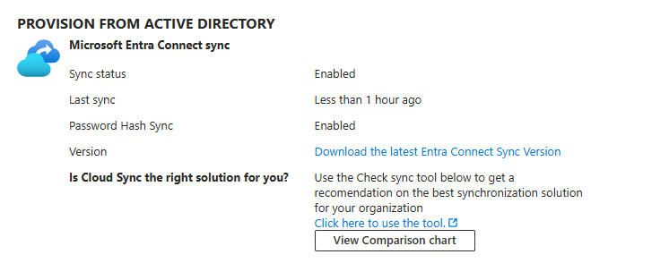

# hybrid-identity-ad-entra-lab

# Hybrid Identity Lab: Active Directory + Microsoft Entra ID

## Overview
Built a hybrid identity environment integrating on-premises Active Directory with Microsoft Entra ID to enable synchronized identities and unified authentication across cloud and on-prem systems.

---

## Domain Ownership Note
When this lab was originally created, the Microsoft Entra tenant was deployed first using the default *.onmicrosoft.com domain. At that time, I did not yet own a custom domain.

Later, after purchasing my own domain (judeidentity.com), I updated the environment to use this domain as the primary UPN suffix for users. This required:

- Adding the custom domain to Microsoft Entra ID  
- Verifying DNS ownership  
- Adding the same UPN suffix inside Active Directory Domains and Trusts  
- Updating Azure AD Connect to use the new UPN suffix for synchronization  

This change aligns the on‑premises AD identities with the cloud tenant and reflects a more realistic enterprise identity setup.


## Environment Setup
- Provisioned a Windows Server virtual machine using Oracle VirtualBox  
- Installed Windows Server using official ISO media  
- Configured Active Directory Domain Services (AD DS)  
- Established domain environment for hybrid identity integration with Microsoft Entra ID  

---

## Architecture
This environment consists of:
- On-premises Active Directory (Windows Server)  
- Microsoft Entra ID (Azure AD)  
- Azure AD Connect for directory synchronization  

---

## Key IAM Concepts
- Identity Synchronization (AD > Entra ID)  
- Authentication across hybrid environments  
- Role-Based Access Control (RBAC)  
- Identity lifecycle management (Joiner/Mover/Leaver)  

---

## Implementation
- Deployed Active Directory domain environment  
- Designed Organizational Unit (OU) structure  
- Created users and security groups in AD via powershell
- Password and logon requirements
- Configured Azure AD Connect for directory synchronization  
- Synced users from AD to Entra ID  
- Joined devices to domain and tested authentication
- Created a domain admin account and added it to a OU

## PowerShell Script
The full automation script is available here:
[AD-Automation.ps1](scripts/AD-Automation.ps1)

## Active Directory Structure (Screenshots)

Below are screenshots of the on‑premises Active Directory structure created for this lab:


## Azure AD Connect Configuration (Screenshots)

Below are the Azure AD Connect configuration screenshots used in this hybrid identity setup.


---

## Validation
- Verified users synced successfully from AD to Entra ID  
- Tested authentication to Microsoft 365 services  
- Confirmed group-based access assignments  

## Azure AD Connect Sync Results

Below are the results showing successful synchronization of on‑premises identities to Microsoft Entra ID.



---

##  Issue: Standard Domain Users Unable to Log In

###  Description
After joining a workstation to the domain, standard users were unable to log in.

Error displayed:
> "The sign-in method you're trying to use isn't allowed."

-  Domain Admin login worked  
-  Standard domain users failed  

---

##  Troubleshooting Steps

### 1. Verify Domain Connectivity
```bash
ping judelab.local
```

### 2. Confirm Machine is Domain Joined
Verified the workstation was successfully joined to the **JUDELAB** domain.

### 3. Attempt Login
```
JUDELAB\esmith
```

### 4. Check Applied Group Policy
```bash
gpresult /r
```

**Observed:**  
`Applied Group Policy Objects: N/A`  
→ This indicated the workstation had **not yet received** the correct domain policies.

### 5. Review GPO Configuration
Navigated to:

```
Computer Configuration
→ Windows Settings
→ Security Settings
→ Local Policies
→ User Rights Assignment
→ Allow log on locally
```

 Confirmed **Domain Users** were allowed to log on locally.  
 **Security Filtering** on the GPO was set to **Authenticated Users**, meaning the policy *should* apply to all domain users and computers.

---

##  Resolution Steps

### 1. Force Group Policy Update
```bash
gpupdate /force
```

### 2. Reboot Workstation
```bash
shutdown /r /t 0
```

### 3. Verify Policy Application
```bash
gpresult /r
```

### 4. Retest Login
```
JUDELAB\esmith
```

---

## Outcome
- Standard domain users successfully logged in  
- Group Policy applied correctly  
- Login restrictions resolved  

---

## Key Takeaways
- **Authentication ≠ Authorization**  
  A user can exist in AD but still be blocked from logging in if permissions aren’t applied.

- **Logon permissions are enforced via Group Policy**  
  The “Allow log on locally” right is critical.

- **Security Filtering matters**  
  If a GPO is not filtered to include the right users/computers, it will never apply.

- **Group Policy changes often require a reboot**  
  Especially on newly joined machines.

- **Domain Admins bypass many restrictions**  
  Which is why admin login worked even when standard users failed.

---

## Root Cause
Group Policy had not fully applied to the workstation after joining the domain.  
Logon rights were not enforced until:

- A Group Policy update, and  
- A system reboot

Once both occurred, standard users were able to authenticate normally.
